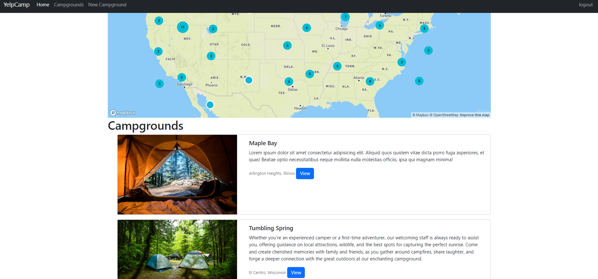
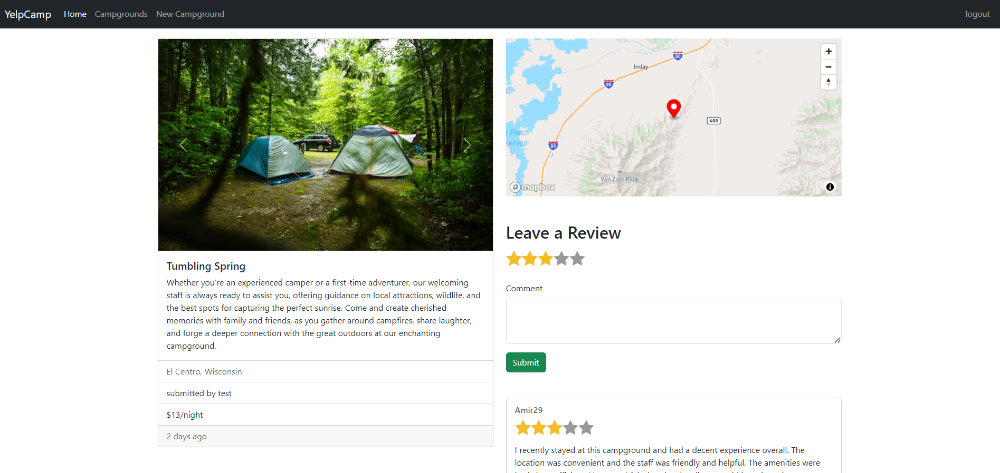

# YelpCamp

  


YelpCamp is a website where users can create and review campgrounds. In order to review or create a campground, you must have an account. This project was part of Colt Steele's web dev course on udemy.

This project was created using Node.js, Express, MongoDB, and Bootstrap. Passport.js was used to handle authentication.

## Features

- Users can check all the campgrounds created in one fancy cluster map
- Users can create, edit, and remove campgrounds
- Users can review campgrounds, and remove their reviews
- Users can create campgrounds with its location detected by its name

## Run it locally

1. Install [mongodb](https://www.mongodb.com/)
2. Create a cloudinary account to get an API key and secret code

```
git clone https://github.com/himanshup/yelpcamp.git
cd yelpcamp
npm install
```

Create a .env file (or just export manually in the terminal) in the root of the project and add the following:

```
DATABASEURL='<url>'
API_KEY=''<key>
API_SECRET='<secret>'
```

Run `mongod` in another terminal and `node app.js` in the terminal with the project.

Then go to [localhost:3000](http://localhost:3000/).

To get mapbox maps working create a public key from their [website](https://www.mapbox.com/).
